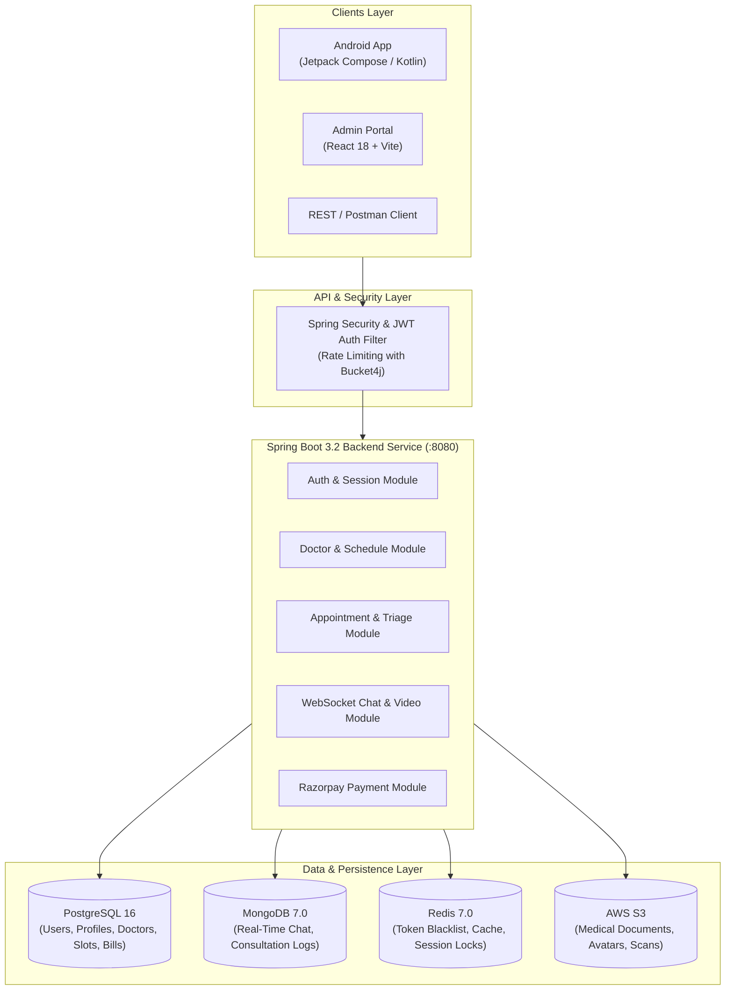

# MediWise — AI/ML Clinical Decision & Real-Time Consultation Platform

[](https://github.com/abhisheksharma-swe/MediWise-Clinical-Decision-and-Real-Time-Consultation-Platform/actions/workflows/ci.yml)
[](https://openjdk.org/)
[](https://spring.io/projects/spring-boot)
[](https://reactjs.org/)
[](https://kotlinlang.org/)
[](https://www.postgresql.org/)
[](https://www.mongodb.com/)
[](https://redis.io/)
[](https://www.docker.com/)

MediWise is an enterprise-grade, full-stack healthcare platform engineered for real-time teleconsultations, AI-assisted symptom analysis, automated clinical triage, doctor schedule management, electronic health records (EHR), and secure payment processing.

---

## Table of Contents

- [Core Features](#core-features)
- [System Architecture](#system-architecture)
- [Technology Stack](#technology-stack)
- [Repository Structure](#repository-structure)
- [Getting Started](#getting-started)
  - [Prerequisites](#prerequisites)
  - [Option A: Run Everything with Docker Compose](#option-a-run-everything-with-docker-compose-recommended)
  - [Option B: Run Services Locally for Development](#option-b-run-services-locally-for-development)
- [Default Seed Accounts & Testing](#default-seed-accounts--testing)
- [Admin Dashboard (mediwise-admin)](#admin-dashboard-mediwise-admin)
- [Android Mobile App (android-app)](#android-mobile-app-android-app)
- [API Documentation & Swagger](#api-documentation--swagger)
- [CI/CD & Deployment](#cicd--deployment)
- [Environment Configuration](#environment-configuration)
- [License](#license)

---

## Core Features

- **AI-Driven Clinical Triage & Symptom Analysis:** Intelligent assessment workflows to route patients to the right medical specialties based on symptoms and severity.
- **Real-Time Video & Chat Teleconsultations:** Low-latency WebSockets (STOMP) for instant doctor-patient messaging, typing indicators, and session states.
- **Dynamic Doctor Scheduling & Slots:** Real-time slot locking, appointment booking, cancellation workflows, and conflict resolution.
- **Integrated Payments:** Seamless billing and invoice generation powered by Razorpay checkout and webhooks.
- **Medical Records & File Storage:** Secure patient health record (EHR) attachments and medical scans backed by AWS S3.
- **Role-Based Access Control (RBAC):** Granular access tiers for `PATIENT`, `DOCTOR`, and `ADMIN` roles secured with JWT and Redis token blacklisting.
- **Administrative Control Center:** Web dashboard for doctor credential verification, patient analytics, appointment tracking, and revenue overview.
- **Modern Android Client:** Native Kotlin app built with Jetpack Compose, Coroutines/Flow, Dagger Hilt, and Firebase Auth.

---

## System Architecture



---

## Technology Stack

| Layer | Technologies |
| :--- | :--- |
| **Backend API** | Java 17/21, Spring Boot 3.2.5, Spring Security, Spring Data JPA, Spring Data MongoDB, Flyway, JJWT, MapStruct, Lombok |
| **Databases & Cache** | PostgreSQL 16, MongoDB 7.0, Redis 7.0 |
| **Admin Web Portal** | React 18, Vite, React Router v6, Axios, Modern CSS |
| **Android Application** | Kotlin, Jetpack Compose, Coroutines & StateFlow, Dagger Hilt, Retrofit 2, OkHttp, DataStore, Firebase Auth |
| **Cloud & Third-Party** | AWS S3, Razorpay API, Firebase Admin SDK, GitHub Actions, GHCR, AWS ECS |

---

## Repository Structure

```text
MediWise-clinical-system/
├── .github/
│   └── workflows/
│       └── ci.yml               # Automated CI/CD (Test, Build, Docker, ECS)
├── backend/                     # Spring Boot 3 Backend Service
│   ├── src/
│   │   ├── main/java/com/mediwise/
│   │   │   ├── appointment/     # Appointments & booking engine
│   │   │   ├── auth/            # Security, JWT, Firebase verifier, AuthController
│   │   │   ├── chat/            # Real-time chat & WebSocket endpoints
│   │   │   ├── common/          # Global exception handler, responses, JWT util
│   │   │   ├── doctor/          # Doctor directories & profiles
│   │   │   ├── payment/         # Razorpay checkout & webhook handler
│   │   │   ├── profile/         # Patient EHR & records
│   │   │   └── schedule/        # Time slots & recurring availability
│   │   └── resources/
│   │       ├── db/migration/    # Flyway migration scripts (V1, V2, V3)
│   │       └── application.yml  # Spring Boot configuration & defaults
│   ├── .env.example             # Backend environment template
│   ├── docker-compose.yml       # Multi-container orchestration
│   ├── Dockerfile               # Multi-stage production container build
│   └── pom.xml                  # Maven dependencies & build definitions
├── mediwise-admin/              # React 18 Admin Dashboard
│   ├── src/                     # Components, pages (Doctors, Patients, Stats)
│   ├── .env.example             # Admin environment configuration
│   └── package.json             # Vite & React scripts
└── android-app/                 # Native Android Client
    ├── app/                     # Jetpack Compose UI, Hilt DI, Repositories
    ├── build.gradle.kts         # Gradle Android build configuration
    └── settings.gradle.kts      # Project settings
```

---

## Getting Started

### Prerequisites

- [Docker Desktop](https://www.docker.com/products/docker-desktop/) (v24+)
- [Java JDK 17+](https://adoptium.net/) & [Maven](https://maven.apache.org/) (for backend development)
- [Node.js](https://nodejs.org/) (v18+) & `npm` (for admin web dashboard)
- [Android Studio](https://developer.android.com/studio) (for mobile application)

---

### Option A: Run Everything with Docker Compose (Recommended)

1. Clone the repository:
   ```bash
   git clone https://github.com/abhisheksharma-swe/MediWise-Clinical-Decision-and-Real-Time-Consultation-Platform.git
   cd MediWise-Clinical-System/backend
   ```

2. Start all services in the background:
   ```bash
   docker compose up --build -d
   ```

3. Verify running containers:
   ```bash
   docker compose ps
   ```

| Service | Address |
| :--- | :--- |
| **Backend REST API** | `http://localhost:8080` |
| **Swagger UI Docs** | `http://localhost:8080/swagger-ui/index.html` |
| **PostgreSQL Database** | `localhost:5432` (`clinical_db`) |
| **MongoDB Database** | `localhost:27017` (`clinical_chat`) |
| **Redis Cache** | `localhost:6379` |

---

### Option B: Run Services Locally for Development

#### 1. Start Infrastructure via Docker
Keep PostgreSQL, MongoDB, and Redis running in Docker while developing the backend in IntelliJ IDEA or VS Code:
```bash
cd backend
docker compose up postgres mongo redis -d
```

#### 2. Run the Spring Boot App
```bash
# Using Maven CLI
mvn spring-boot:run

# Or run ClinicalBackendApplication.java in IntelliJ IDEA
```

#### 3. Start the Admin Dashboard (`mediwise-admin`)
```bash
cd ../mediwise-admin
npm install
npm run dev
```
Access the web dashboard at `http://localhost:5173`.

#### 4. Run the Android App (`android-app`)
1. Open `android-app` in **Android Studio**.
2. Sync Gradle dependencies.
3. Launch an Android Emulator or connect a physical device.
4. Click **Run** (`Shift + F10`).

---

## Default Seed Accounts & Testing

The database automatically seeds standard administrative and clinical accounts on startup:

| Account Role | Email Address | Default Password | Purpose |
| :--- | :--- | :--- | :--- |
| **`ADMIN`** | `admin@mediwise.com` | `Doctor@12345` | Hospital administration, doctor verification & platform stats |
| **`DOCTOR`** (Cardiology) | `dr.sarah@mediwise.com` | `Doctor@12345` | Interventional cardiologist consultation profile |
| **`DOCTOR`** (General Med) | `dr.rajesh@mediwise.com` | `Doctor@12345` | General physician & diabetologist profile |
| **`DOCTOR`** (Dermatology) | `dr.elena@mediwise.com` | `Doctor@12345` | Specialist dermatologist profile |
| **`DOCTOR`** (Neurology) | `dr.marcus@mediwise.com` | `Doctor@12345` | Consultant neurologist profile |

---

## API Documentation & Swagger

Interactive OpenAPI documentation is embedded directly in the application:
- **Swagger UI**: [http://localhost:8080/swagger-ui/index.html](http://localhost:8080/swagger-ui/index.html)
- **OpenAPI JSON Spec**: [http://localhost:8080/api-docs](http://localhost:8080/api-docs)

### Quick Authentication Test (Postman / `curl`)

#### 1. Login Request:
```bash
curl -X POST http://localhost:8080/api/v1/auth/login \
  -H "Content-Type: application/json" \
  -d '{
    "emailOrPhone": "admin@mediwise.com",
    "password": "Doctor@12345"
  }'
```

#### 2. Access Protected Endpoint with Bearer Token:
```bash
curl -X GET http://localhost:8080/api/v1/auth/me \
  -H "Authorization: Bearer <YOUR_ACCESS_TOKEN>"
```

---

## CI/CD & Deployment

The platform includes an enterprise CI/CD workflow configured in [`.github/workflows/ci.yml`](.github/workflows/ci.yml):

```text
  [Git Push / PR] 
        │
        ├──► Job 1: Backend CI (Java 17, Postgres, Mongo & Redis test containers, Maven verify)
        ├──► Job 2: Admin CI (Node 20, npm install, Vite build)
        │
    (On merge to 'main')
        │
        ├──► Job 3: Build Multi-Stage Docker Image & Push to GitHub Container Registry (GHCR)
        └──► Job 4: Deploy Task Definition to AWS ECS Cluster (ap-south-1)
```

### Required GitHub Secrets (for AWS Deployment)
- `AWS_ACCESS_KEY_ID`: AWS IAM access key with ECS deployment permissions.
- `AWS_SECRET_ACCESS_KEY`: AWS IAM secret key.
- `AWS_REGION`: AWS region (e.g. `ap-south-1`).

---

## Environment Configuration

| Variable | Description | Default / Example |
| :--- | :--- | :--- |
| `SPRING_DATASOURCE_URL` | JDBC URL for PostgreSQL | `jdbc:postgresql://localhost:5432/clinical_db` |
| `DB_USERNAME` | PostgreSQL username | `clinical_user` |
| `DB_PASSWORD` | PostgreSQL password | `clinical_pass` |
| `MONGODB_URI` | MongoDB connection string | `mongodb://localhost:27017/clinical_chat` |
| `REDIS_HOST` | Redis cache hostname | `localhost` / `redis` |
| `REDIS_PORT` | Redis cache port | `6379` |
| `JWT_SECRET` | HMAC-SHA256 Secret (min 256 bits) | Configured in .env |
| `RAZORPAY_KEY_ID` | Razorpay Merchant Key ID | `rzp_test_key` |
| `RAZORPAY_KEY_SECRET` | Razorpay Merchant Secret | `rzp_test_secret` |
| `AWS_ACCESS_KEY` | AWS S3 IAM Access Key | `your_aws_access_key` |
| `AWS_SECRET_KEY` | AWS S3 IAM Secret Key | `your_aws_secret_key` |
| `S3_BUCKET` | AWS S3 storage bucket name | `clinical-system-files` |

---

## License

This project is licensed under the **MIT License** — see the [LICENSE](LICENSE) file for details.

---

Built for healthcare accessibility and real-time clinical decision support.
